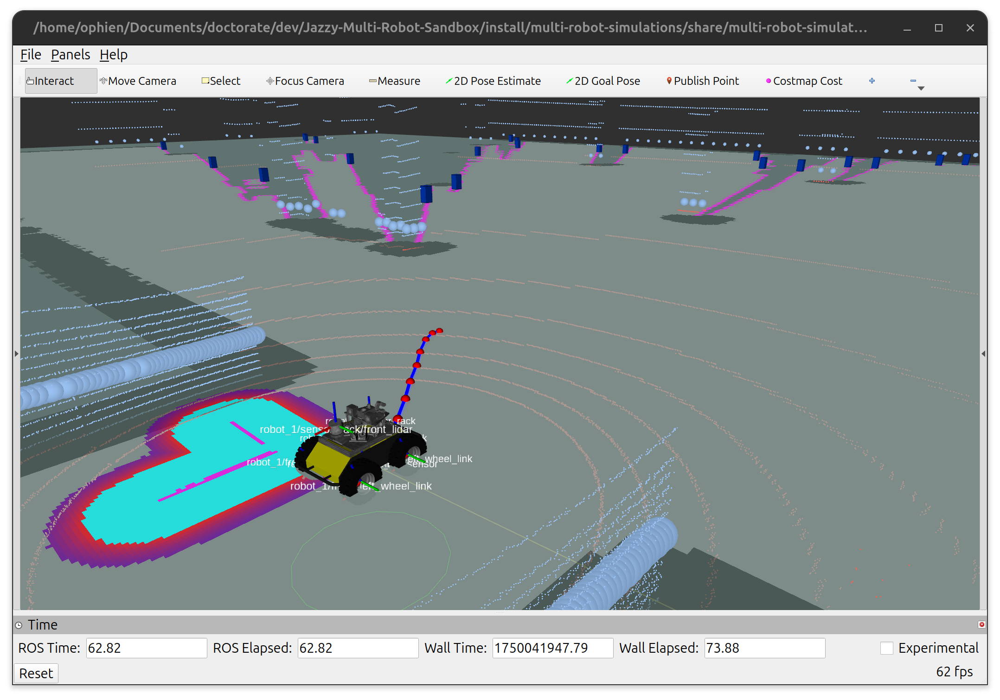

# [Exploration Tools](#exploration_tools)

Frontier Exploration Utilities for ROS 2

This repository provides core utilities, packages, and nodes for classic multi-robot frontier-based exploration in ROS 2. It includes robust occupancy grid processing, frontier detection, and costmap/c-space generation for safe and efficient autonomous exploration.

    

## [Nodes](#nodes)

- [FrontierDiscoveryNode](./frontier_exploration/include/FrontierDiscoveryNode.h): Detects and publishes frontiers from occupancy grids.
- [OccupancyGridFilter](./frontier_exploration/include/OccupancyGridFilters.h): (If present) Handles local C-space generation for individual robots.

## [Custom Messages](#custom-messages)

This package uses custom messages for frontiers and robot poses. Make sure to build the package so message headers are generated.

## [Support this Project](#support-this-project)

Support this open-source project.

## [License](#license)

All content from this repository is released under a [GPLv3 license](LICENSE).

Author/Maintainer:

- [Alysson Ribeiro da Silva](https://alysson.thegeneralsolution.com/)

emails:

- <alysson.ribeiro.silva@gmail.com>

## [Bug & Feature Requests](#bug--feature-requests)

Please report bugs and do your requests to add new features through the [Issue Tracker](https://github.com/multirobotplayground/Multi-robot-Intermittent-Rendezvous/issues).
